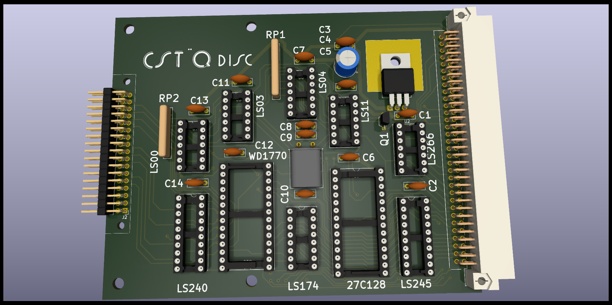
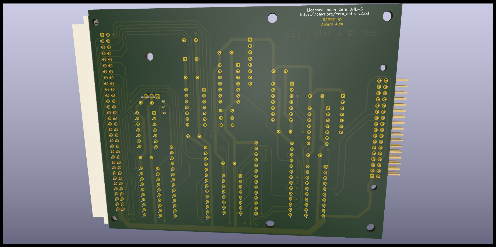

# QL_CST_FLoppyController_V4

A clone of the CST's Floppy Disk Interface for Sinclair QL 
(PCB version 4, ROM version 1.18)

## WARNING: THIS IS WORK IN PROGRESS

The board has been tested and seen to work correctly, but used it with by RAM expansion board kill
the GAL chip of the RAM expansion, I'm still checking what happend, so use at your own risk.

This board is an advanced version of teh CST Floppy Disk Interface, there are two main diferences with version 3
* The ROM is scrambled, so read directly from the chip do not provide usefull information.
* It have a more efficient use of the ROM space, and up to 14Kb are used by the ROM, 
while previous version only have 8Kb of ROM.

It use the standar stugart conector, so a plain cable can have up to 2 disk drives, that shall be correctly configured as DS0 and DS1.

It use a WD1770 disc controller, and is expected that will be compatible with WD1772, WD1773 need to be checked.

Thanks to Derek_Stewart and techy of qlforum.co.uk for providing the pictures that allow me to capture the schema.

A interactive bill of materials is available here:

https://alvaroalea.github.io/QL_CST_FLoppyController_V4/ibom.html

 

 

