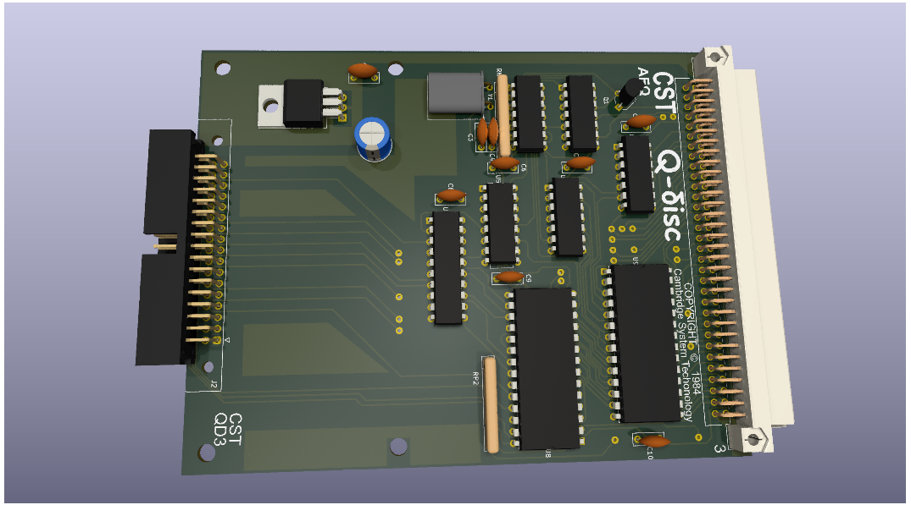
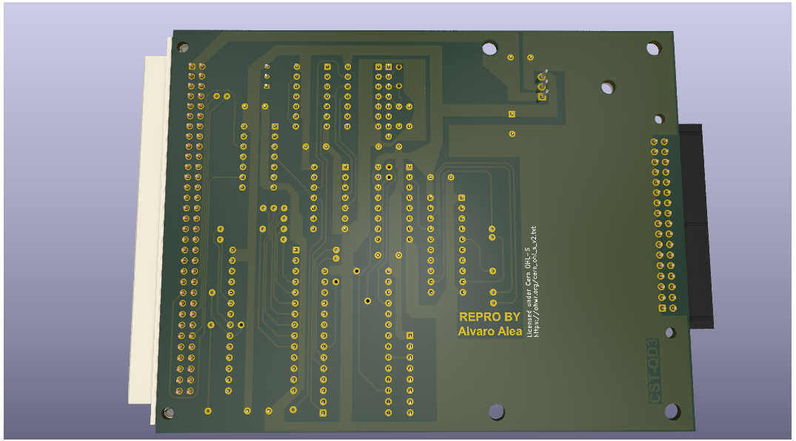

# QL_CST_FLoppyController

A clone of some version of the CST's Floppy Disk Interface for Sinclair QL

## History

CST was one of the main manufacturer of add-on for the Sinclair QL computer, this include backplanes, memory expansions and disc interfaces.

The Disk interface evolved over several version, with enhaced compatibilities in each version.

- Issue 1 - I can't get information about this Issue on internet.
- Issue 2 - This version use ReVision 1.13 of the ROM, of 8Kb, zxcvzxcv got the schematic an create a clone.
- Issue 3 - This version use Revision 1.16 of the ROM, of 8Kb, new clock circuit and 1 missing track on the PCB, is possible to upgrade Issue 2 to ROM 1.16 if isolate the PIN 3 of IC3 (74LS03).
- Issue 4 - This version use Revision 1.18/1.19 of the ROM, diferent circuit, increase the ROM size to 12Kb (use a 16Kb Eprom chip), now include RAM disk driver in rom, this version se a scrambled ROM, so when read with a external device, you can see the code.

Version 1.19 of ROM is missing in action, other version area available to download here: https://dilwyn.theqlforum.com/qlrom/index.html

Nowday I have draw and test the PCB of Issue 3 and 4, they are in separate folders, including, manuals and and ROM image.

## The Board

It use the standar stugart conector, so a plain cable can have up to 2 disk drives, that shall be correctly configured as DS0 and DS1.

It use a WD1770 disc controller, and is expected that will be compatible with WD1772 (not checked), WD1773 is not compatible.

Thanks to Derek_Stewart and techy of qlforum.co.uk for providing the pictures that allow me to capture the schema.

A interactive bill of materials for each board is available here:

* https://alvaroalea.github.io/QL_CST_FLoppyController/ibom_3.html
* https://alvaroalea.github.io/QL_CST_FLoppyController/ibom_4.html

### WARNING: Use good components!

During testing we found that bulk unknow 2N2222 transistor seen to work, but have hard compatibility problems with other boards.

Using a wellknow source transistor eliminate the incompatibility and work correctly with other passthrough boards. Be aware if you use a external or internal RAM expansion, a Qbide with passtrough or a backplane that allow several boarda.

### Qdisk Issue 4

### Qdisk Issue 3

